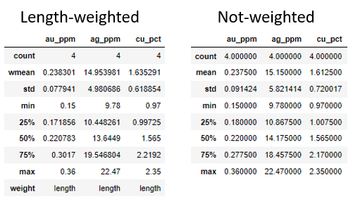

# Describew
 A function that returns the same output of .describe(). but considering a weight variable.
 It was designed originally to deal with drill holes, on the exploratory data analysis procedures.
 
## Mandatory libraries
 To this function, the three libaries below are necessary.
```python
import pandas as pd
import numpy as np
import math
```
## Function code
 The function code receives as input the dataframe, a list of numeric variables in the dataframe, and the weight column.
 For each variable of the list a new dataframe wil be built containing the same outcome of ".describe()", but with the mean and standard deviation weighted by a variable.
```python
def describew(df, var, weight):
    variables, Count, WMean, STD, Minimum, Q25, Q50, Q75, Maximum = [], [], [], [], [], [], [], [], []
    for i, v in enumerate(var):
        # Count, weighted mean, std, minimum and maximum determination
        variables.append(var[i])
        Count.append(len(df[v]))
        wavrg = np.average(df[v], weights=df[weight])
        WMean.append(wavrg)
        variance = (np.average((df[v] - wavrg) ** 2, weights=df[weight]))
        STD.append(math.sqrt(variance))
        Minimum.append(df[v].min())
        Maximum.append(df[v].max())

        # Quantiles determination
        sort_idx = np.argsort(df[v])
        values_sort = df[v][sort_idx]
        weight_sort = df[weight][sort_idx]

        assert np.sum(weight_sort) != 0., "The sum of the weights must not equal zero"
        weights = np.array(weight_sort)
        sumweights = np.sum(weights)
        offset = (weights[0] / sumweights) / 2.
        probs = np.cumsum(weights) / sumweights - offset
        Q25.append(np.interp(x=0.25, xp=probs, fp=values_sort, left=None, right=None, period=None))
        Q50.append(np.interp(x=0.50, xp=probs, fp=values_sort, left=None, right=None, period=None))
        Q75.append(np.interp(x=0.75, xp=probs, fp=values_sort, left=None, right=None, period=None))

    # Tabluating the results
    result = pd.DataFrame({'': variables,
                           'count': Count,
                           'wmean': WMean,
                           'std': STD,
                           'min': Minimum,
                           '25%': Q25,
                           '50%': Q50,
                           '75%': Q75,
                           'max': Maximum,
                           'weight': weight})
    result.set_index('', inplace=True)
    return result.transpose()
```
## Example
As example, let's create a simple dataframe with four variables, being three of them metal grades (au_ppm, ag_ppm, cu_pct) and the last one the length of each sample, which will be used as weight.
If you already have a database, you can import it as a datamframe and work with your own variables.
```python
df = pd.DataFrame(
    {
        "au_ppm": [0.15, 0.25, 0.36, 0.19],
        "ag_ppm": [17.12, 11.23, 9.78, 22.47],
        "cu_pct": [2.35, 2.11, 1.02, 0.97],
        "length": [1., 1.15, 1., 0.97],
    })
```
After that, it is necessary to create a list with the variables that you want to get the weighted stats. You need to create a list even you have just one variable.
Finally, to call the function it will need three parameters, the dataframe, list of variables and the weight variable to be used. The weight variable needs to be inserted as it is in the dataframe. 
```python
variables = ['au_ppm', 'ag_ppm', 'cu_pct']
describew(df, variables, 'length')
```

